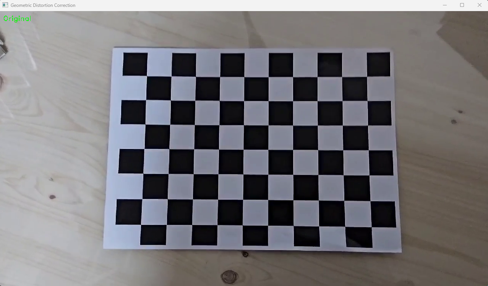
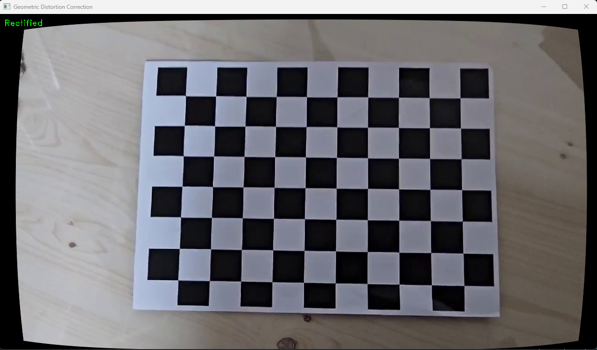
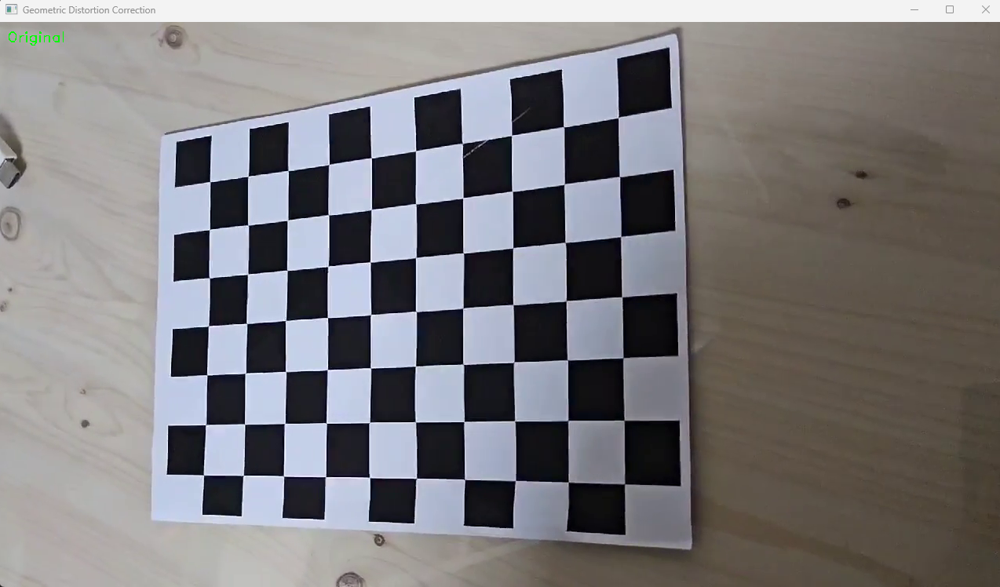
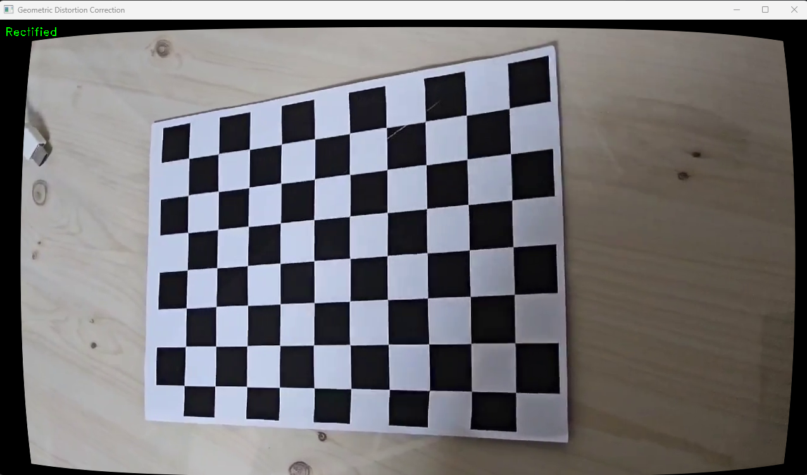

# CalibrationChessboard

- **camera clibration**  
  : A program to find camera calibration through video through a chessboard
  : Calculate camera parameters (focal length, principal point...) and RMS error.
- **distortion correction**  
  : A program that corrects camera distortion in captured images or videos.

### 1. Camera Calibration Results

> - The number of selected images = 37
> - RMS error = 0.6531321976240777
> - Camera matrix (K) =  
>    [[1.20105746e+03 0.00000000e+00 6.34435026e+02]
[0.00000000e+00 1.20893667e+03 3.53765890e+02]
[0.00000000e+00 0.00000000e+00 1.00000000e+00]]
> - Distortion coefficient (k1, k2, p1, p2, k3, ...) =  
>   [ 1.99616322e-01 -1.02188362e+00 -6.70423343e-03 -3.28932459e-03 3.59774606e+00]

fx = 1201 (1.20105746e+03)  
fy = 1209 (1.20893667e+03)  
cx = 634 (6.34435026e+02)  
cy = 354 (3.53765890e+02)  
rmse = 0.6531321976240777

 

### 2. distortion correction

